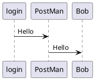
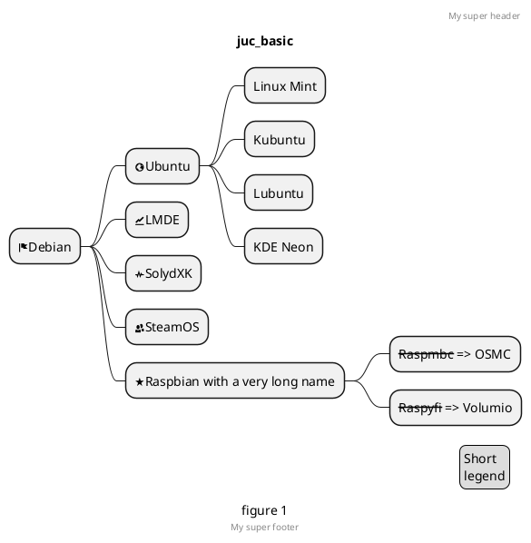

## Test plantuml

```java
 public class Demo{
    private String name;
    private Integer age;
}
```


```plantuml
@startuml

login->PostMan:Hello

PostMan->Bob:Hello   

@enduml
```


```plantuml
@startmindmap
'https://plantuml.com/mindmap-diagram

caption figure 1
title juc_basic

* <&flag>Debian
  ** <&globe>Ubuntu
  *** Linux Mint
  *** Kubuntu
  *** Lubuntu
  *** KDE Neon
  ** <&graph>LMDE
  ** <&pulse>SolydXK
  ** <&people>SteamOS
  ** <&star>Raspbian with a very long name
  *** <s>Raspmbc</s> => OSMC
  *** <s>Raspyfi</s> => Volumio

header
My super header
endheader

center footer My super footer

legend right
Short
legend
endlegend
@endmindmap
```


